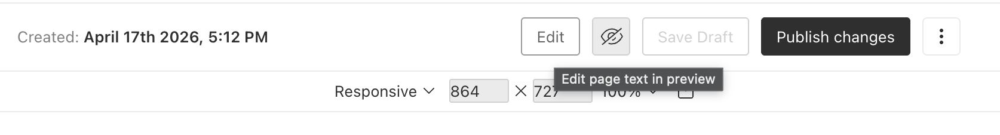
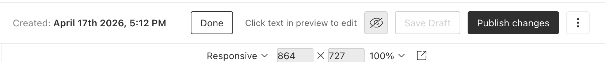

# payload-visual-editor

Inline visual editing for [Payload CMS](https://payloadcms.com) live preview.


 Edit text directly in the preview iframe; changes sync back to the admin document form and save as a draft.

<details>
<summary><b>Demo video</b> — click to expand (~9 MB, loads on demand)</summary>
<br>

<video controls preload="none" poster="media/video-poster.png" width="720">
  <source src="media/payload-visual-editor.mov" type="video/quicktime">
  <a href="media/payload-visual-editor.mov">Play or download demo</a>
</video>

</details>

## Features

- Edit **text**, **textarea**, **number**, and **richText** fields from the live preview
- Automatic text matching — no `data-*` attributes or field wrappers in your frontend
- Case-insensitive matching (e.g. CSS `text-transform: uppercase` on titles)
- **Edit / Done** control in the admin document bar when live preview is active
- Commits in-progress edits and saves a **draft** when you click **Done**
- Per-collection allowlists and blocklists for field paths

## Requirements

- Payload `^3.84.0`
- `@payloadcms/ui` and `@payloadcms/live-preview` (peer dependencies)
- Live preview configured on the collection
- `VisualEditorListener` mounted in your frontend root layout

## Installation - not yet published!

```bash
pnpm add @krzysztofradomski/payload-visual-editor
```

When developing against a local checkout, link with `file:` and run `pnpm build` in the plugin package after changes.

## Plugin configuration

```ts
import { payloadVisualEditor } from '@krzysztofradomski/payload-visual-editor'

export default buildConfig({
  plugins: [
    payloadVisualEditor({
      collections: {
        // Enable all editable field types for this collection
        articles: true,

        // Or restrict which fields can be edited in the preview
        'static-pages': {
          excludeFields: ['slug'],
        },

        // Allowlist only specific paths
        pages: {
          fields: ['title', 'hero.body'],
        },
      },

      // Optional — defaults to text, textarea, number, richText
      editableFieldTypes: ['text', 'textarea', 'number', 'richText'],
    }),
  ],
})
```

### Collection options

| Value                          | Description                                           |
| ------------------------------ | ----------------------------------------------------- |
| `true`                         | All fields matching `editableFieldTypes` are editable |
| `{ fields?: string[] }`        | Only these dot-paths (e.g. `meta.title`)              |
| `{ excludeFields?: string[] }` | Remove paths from the editable set (e.g. `slug`)      |

The plugin registers an **Edit** button via `beforeDocumentControls` on enabled collections. No manual admin component wiring is required.

## Frontend setup

Add the listener once to your frontend root layout (the layout used for live-preview URLs):

```tsx
import { VisualEditorListener } from 'payload-visual-editor/client'

export default function RootLayout({ children }: { children: React.ReactNode }) {
  return (
    <html>
      <body>
        {children}
        <VisualEditorListener />
      </body>
    </html>
  )
}
```

### Next.js

Transpile the package and allow ESM subpath imports:

```js
// next.config.js
/** @type {import('next').NextConfig} */
const nextConfig = {
  transpilePackages: ['payload-visual-editor'],
  webpack: (config) => {
    config.module.rules.push({
      test: /\.m?js$/,
      include: /payload-visual-editor/,
      resolve: { fullySpecified: false },
    })
    return config
  },
}

module.exports = nextConfig
```

If you already have a `webpack` function, merge this rule into it instead of replacing the whole callback.

## Usage

1. Open a document that has **live preview** enabled.
2. Click **Edit** in the admin bar (next to save / draft controls).
3. In the preview, hover text that matches a configured field — it is outlined in blue.
4. Click to edit inline, then blur to apply the change to the form.
5. Click **Done** to exit edit mode, commit any active edit, and save the document as a **draft**.

Edits update the admin form immediately. Draft saves are debounced while editing; **Done** flushes any pending save.

### How matching works

The listener loads editable field paths from the API, subscribes to live-preview document data, and builds a lookup from field values (including rich text plain text and paragraph segments). Visible DOM text is matched case-insensitively; the smallest matching element is preferred when walking up the tree.

Your templates only need to render the same text as stored in Payload — no special markup.

## API

### `GET /api/visual-editor/fields?collection={slug}`

Returns editable field descriptors for an enabled collection.

```json
{
  "collection": "articles",
  "fields": [
    { "path": "title", "type": "text" },
    { "path": "richContent", "type": "richText" }
  ]
}
```

Returns `400` if the collection is not enabled for visual editing.

## Exports

| Import                         | Description                                                                    |
| ------------------------------ | ------------------------------------------------------------------------------ |
| `payload-visual-editor`        | Plugin (`payloadVisualEditor`) and types                                       |
| `payload-visual-editor/client` | `VisualEditorListener`, `VisualEditorAdmin` (used automatically by the plugin) |
| `payload-visual-editor/rsc`    | Re-exports for RSC-compatible setups                                           |

## Development

```bash
pnpm install
pnpm build
pnpm test:int
```

## License

MIT
